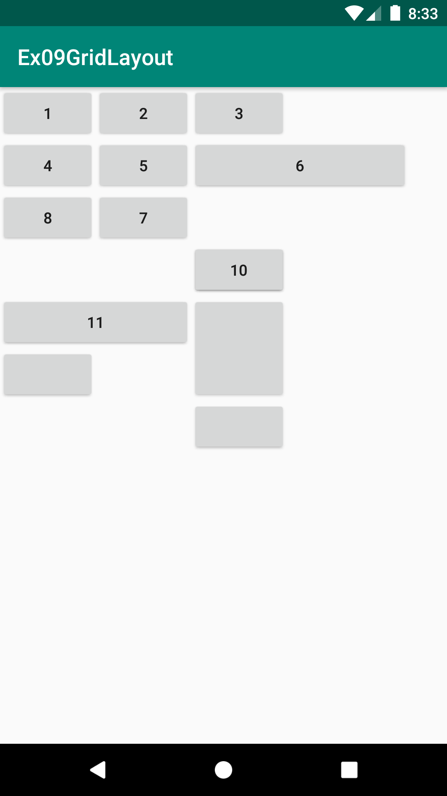
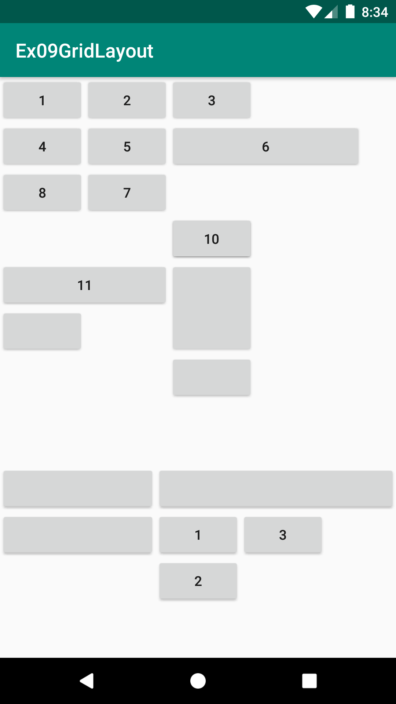

# Ex09GridLayout
안드로이드 네이티브 앱 개발 수업 예제#9

# 주요코드
GridLayout 알아보기
 > TableLayout의 미흡한 점을 개선하기 위해 만든 레이아웃, 뷰들이 겹쳐지며, RowSpan이 가능함, TableRow같은 중첩구조가 없음

- res폴더>>layout폴더안에 있는 activity_main.xml문서를 수정하여 화면제작
- GridLayout의 layout_column, layout_row, layout_columnSpan, layout_rowSpan, layout_gravity속성들 적용
- TableLayout처럼 stretchColumn이 없기에 균등분할이 더 어려움 (API21버전이상에는layout_columnWeight속성으로 LinearLayout의 layout_weight같은 능력의 셀(뷰) 사이즈 지정이 가능함)

# 실행모습

  
  

